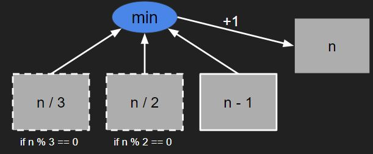

# [BOJ] 1로 만들기

[https://www.acmicpc.net/problem/1463](https://www.acmicpc.net/problem/1463)

<br />
<br />

## 1. 아이디어💡

### 1.1. 문제분석

- 3가지의 액션을 적절하게 사용해서 n을 1로 만들어야한다.
- 1로 만들 때 최소한의 액션을 사용하고 액션을 한 횟수를 출력한다.

<br />

### 1.2. 해결 방법

> 다이나믹 프로그래밍으로 해결한다.

n을 1로 만들기 위한 최소값은 n/3, n/2, n-1 을 1로 만들기 위한 최소값들 중에 최소값에다가 1을 더한 값이다. 



<br />

1. n/3, n/2, n-1의 값을 알 수 없으므로 2부터 차례대로 계산해서 리스트에 값을 저장한다.
2. n의 값을 구하면 그 값을 출력한다.

<br />
<br />

## 2. 테스트 케이스

다이나믹 프로그래밍을 하지 않으면 실패하는 테스트 케이스들

입력
```
80
```
출력
```
6
```

<br />

입력
```
25
```
출력
```
5
```