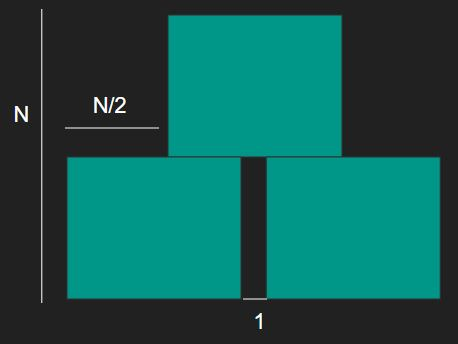

# [BOJ] 별찍기 11

문제링크 : [https://www.acmicpc.net/problem/2448](https://www.acmicpc.net/problem/2448)

<br />

## 🔍 문제분석

- 입력은 3x2^(10)의 형태로 주어진다.
- 가장 작은 단위의 삼각형은 다음과 같이 생겼다.

```
  *  
 * * 
*****
```

- 작은 단위의 삼각형이 3개 모여서 다음과 같은 형태가 된다.

```
     *     
    * *    
   *****   
  *     *  
 * *   * * 
***** *****
```

- 위의 과정을 한번더 반복하면 다음과 같은 형태가 된다.

```
           *           
          * *          
         *****         
        *     *        
       * *   * *       
      ***** *****      
     *           *     
    * *         * *    
   *****       *****   
  *     *     *     *  
 * *   * *   * *   * * 
***** ***** ***** *****
```

<br/>

## 💡 아이디어

> 재귀 함수를 이용한다.

1. n을 입력 받으면 n개의 줄을 3개의 작은 n/2 공간으로 채운다.



2. 작은 공간은 1번 과정에 n/2를 입력으로 주어진것과 같다.

3. 3을 입력으로 받을 때까지 앞의 과정을 반복

3. 3을 입력으로 받으면 가장 작은 단위의 삼각형을 출력한다.

```
  *  
 * * 
*****
```
