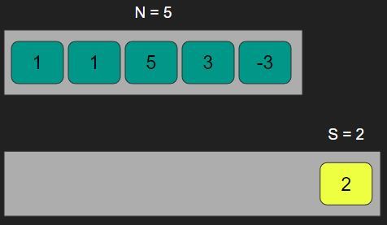
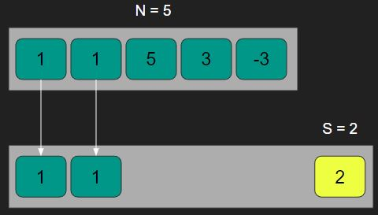
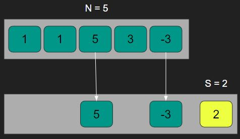
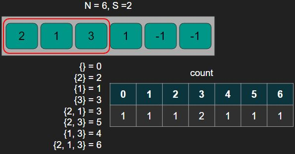
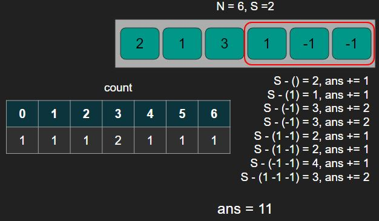

# [BOJ] 부분수열의 합 2

문제링크: [https://www.acmicpc.net/problem/1208](https://www.acmicpc.net/problem/1208)

<br/>

## 🔍 문제분석

- N개의 부분수열의 요소들 중 하나이상을 선택해서 모두 더한 값이 S가 되는 경우의 수를 출력한다.
- 아무것도 선택하지 않는 경우의 수는 포함하지 않는다.

N=5, S=2인 경우 예시)



{1, 1}을 선택한 경우



{5, -3}을 선택한 경우



~~총 경우의 수 = 2~~ 수정

{1, 1, 3, -3}을 선택 했을 때도 2 이므로

총 경우의 수 = 3

입력
```
5 2
1 1 5 3 -3
```

출력
```
3
```

<br/>
<br/>

## 💡 아이디어

모든 경우의 수를 탐색해서 계산하는 방법도 있지만 그 방법은 최대 2^(40) - 1 의 시간이 걸리므로 시간초과가 될게 뻔하다. 하지만 다음의 방법을 사용하면 시간을 절반으로 줄일 수 있다.

1. 수열을 반으로 나눠서 첫번째 부분 수열의 모든 경우에 대한 합을 구해서 나오는 값을 카운팅한다.



2. 나머지 부분수열의 경우의 수를 모두 계산해서 S가 되기 위해 필요한 나머지 값을 count 리스트의 인덱스에서 찾아서 그 value를 출력할 변수에 더해준다. (그림에서 출력값은 11)


