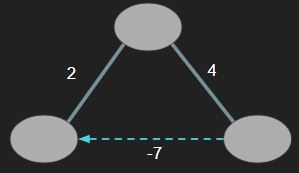
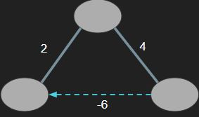

# [BOJ] 웜홀
문제링크: [https://www.acmicpc.net/problem/1865](https://www.acmicpc.net/problem/1865)

 

## 🔍 문제분석

- 음의 사이클을 찾아야하는 문제; 음의 사이클이란 사이클 내에 모든 간선의 합이 음이 되는 사이클
- 다음 그림은 3개의 지역에 2개의 도로와 1개의 웜홀이 연결되어 있는 모습이다. 3지역을 한 바퀴 돌면 시간이 -1이 되므로 이 경우에는 YES를 출력한다.

- 다음 그림은 한바퀴를 돌면 0이다. 시간이 뒤로 가지 않았으므로 NO를 출력한다.

## 💡 아이디어

> 음의 사이클을 탐지할 수 있는 벨만-포드 알고리즘을 사용한다.

 

### 벨만-포드 알고리즘

- 모든 간선을 확인하면서 노드간의 최단거리를 구해나가는 과정을 (정점-1)번 반복한다.

- 음수 간선이 있어도 최적의 해를 구할 수 있다.

 

## 음수 사이클 탐지하기

벨만-포드 알고리즘으로 구한 최단거리테이블을 한번더 모든 간선을 확인해보고 새로운 최단거리가 업데이트 된다면 음수 사이클이 존재한다는 것이다.