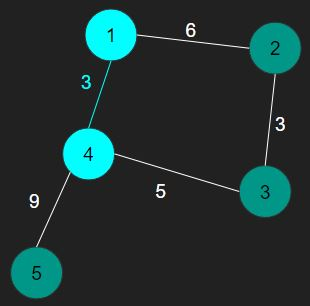
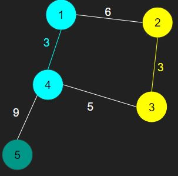
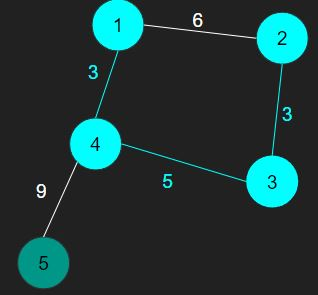
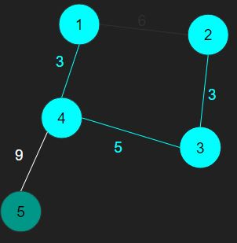
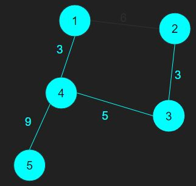

# [BOJ] 최소 스패닝 트리

문제링크: [https://www.acmicpc.net/problem/1197](https://www.acmicpc.net/problem/1197)

 

## 🔍 문제분석

- 노드와 간선들이 입력으로 주어진다.
- 여러 간선 중 (노드-1)개의 간선을 선택해서 최소한의 가중치를 갖는 트리를 구해야한다. (최소 스패닝 트리)

 
 

## 💡 아이디어

> union-find 알고리즘을 사용한다.

1. 간선을 가중치를 기준으로 오름차순으로 정렬한다.
2. 간선 가중치가 낮은 것부터 차례대로 선택한다.
3. 간선을 선택할 때 간선에 포함된 두 노드를 한 그룹으로 묶는다. 만약 두 간선이 이미 한 그룹에 속해 있다면 사이클을 발생하므로 해당 간선은 선택하지 않는다.

 
 

## 동작과정 예시

위의 그림은 입력으로 받은 그래프이다.

1. 가장 가중치가 낮은 간선이 1-4 간선을 선택하고 1과 4를 같은 집합에 넣는다.

2. 그 다음 간선으로 2-3을 선택하고 2와 3을 같은 집합에 넣는다.

3. 3-4 간선을 선택해서 3과 4는 각각 서로 다른 그룹에 속해있으므로 같은 그룹으로 묶어준다.

4. 1-2간선을 보면 1과 2는 이미 같은 그룹에 속해 있기 때문에 선택하지 않는다.

5. 4-5간선을 선택해서 같은 집합에 넣고 선택한 간선들의 합을 출력한다.

