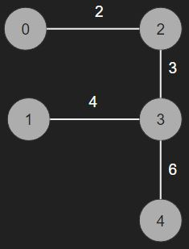

# [BOJ] 트리의 지름
문제링크: [https://www.acmicpc.net/problem/1167](https://www.acmicpc.net/problem/1167)

<br />

## 1. 아이디어💡

### 1.1. 문제분석

- 트리에서 가장 먼 두개의 노드의 거리를 구해야한다.
- 노드간에 거리가 주어진다.

<br />
<br />

### 1.2. 해결 방법

> 플로이드 와샬 알고리즘 사용해본 결과 -> 메모리 초과
>> 모든 노드가 다른 모든 노드의 거리에 대한 정보를 저장하는 것은 공간 복잡도가 커짐

> 트리는 최소 간선 수를 가진다는 것을 이용, 거리 탐색할 때는 BFS 사용

<br />

1. 각 노드와 연결된 간선의 정보를 dictionary로 저장한다. 만약 입력이 다음과 같이 주어지면 

```
5
1 3 2 -1
2 4 4 -1
3 1 2 4 3 -1
4 2 4 3 3 5 6 -1
5 4 6 -1
```

실제 노드번호는 (입력된 노드번호 - 1)로 저장되고 그 형태는 다음과 같다.

```
{2: 2}
{3: 4}
{0: 2, 3: 3}
{1: 4, 2: 3, 4: 6}
{3: 6}
```

<br />



2. 임의의 단말 노드를 하나 정해서 다른 모든 노드에 대한 거리 탐색을 해서 가장 먼 거리의 노드를 찾는다. ex) 0번 노드에서 탐색하면 4번노드까지 11의 최대 거리를 가진다.
3. 찾은 최대 거리를 가지는 노드에서 다시 탐색을 해서 찾은 최대거리가 트리의 지름이다. ex) 4번 노드에서 다시 탐색하면 0번노드까지 11의 최대거리를 가진다.