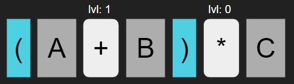

# [BOJ] 후위 표기식

문제링크 : [https://www.acmicpc.net/problem/1918](https://www.acmicpc.net/problem/1918)

<br />
<br />

## 1. 아이디어💡

### 1.1. 문제분석


- 후위 표기식은 연산자가 피연산자 뒤에 있는 표기법
- 식을 왼쪽부터 순차적으로 읽어서 처음 만나는 연산자로 바로 앞에 두 피연산자를 연산한다.

ex)

```
A+B*C-D/E
```

output:

```
ABC*+DE/-
```

<br />

### 1.2. 해결 방법

연산자의 괄호 단계를 결정할 lvl이라는 요소를 만들었다.



`+`는 괄호 1개 안에 있기 때문에 lvl이 1이고 `*`는 괄호 밖에 있기 때문에 lvl이 0이다. 이것으로 우선 순위를 따질 수 있게 된다.

후위표기식을 출력할 때 다음의 규칙으로 출력한다.

- 입력으로 받은 전위표기식을 왼쪽부터 탐색한다.
- 대문자는 바로 출력한다.
- 연산자는 스택에 쌓는다.
- 스택에 연산자가 있을 경우 다음 연산자를 만났을 때 다음 연산자가 우선순위가 높으면 스택에 다음 연산자를 쌓고 아니라면 스택에 연산자를 꺼내서 출력하고 다음 연산자를 스택에 쌓는다.