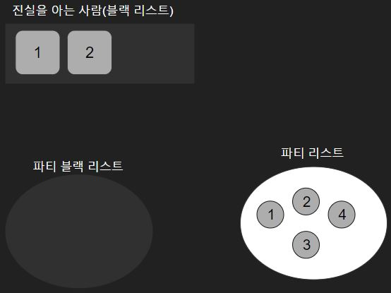
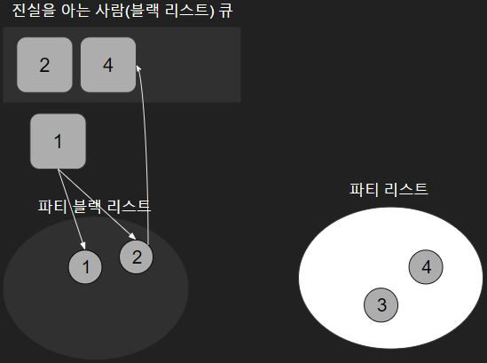
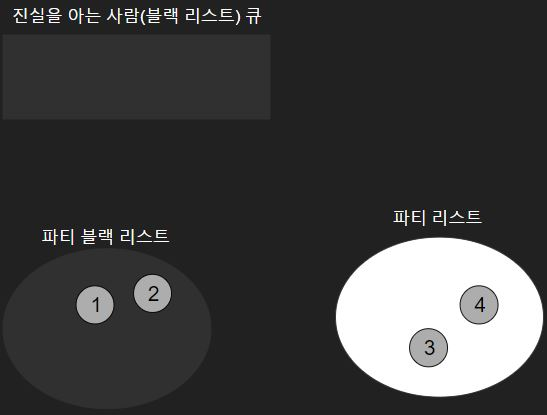

# [BOJ] 거짓말

[https://www.acmicpc.net/problem/1043](https://www.acmicpc.net/problem/1043)

 
 

## 1. 아이디어💡

### 1.1. 문제분석

- 진실을 아는 사람이 참석하는 파티에서는 거짓말을 하면 안된다.
- 진실을 아는 사람이 참석한 파티에 참석한 진실을 모르는 사람이 참석한 또 다른 파티에서도 거짓말을 하면 안된다.
- 파티를 사람들 간에 관계라고 했을 때, 진실을 아는 사람과 관계가 여러단계 건너 있더라도 연결되어 있다면 그 사람이 있는 파티에서는 거짓말을 하면 안된다.

 

### 1.2. 해결 방법

1. 진실을 아는 사람들의 리스트를 큐에 넣는다.

 

2. 큐에서 앞에 요소를 꺼내서 그 사람이 참가한 파티들을 모두 파티 블랙리스트에 넣고 거기에 참가한 블랙리스트가 아니었던 사람들 모두 큐에 넣는다.

 

3. 위의 과정을 반복한다.

4. 파티리스트에 남은 요소의 개수를 출력한다.
