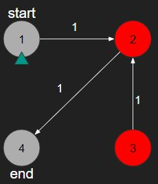
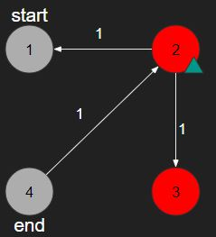
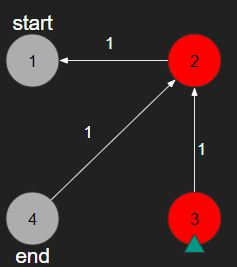
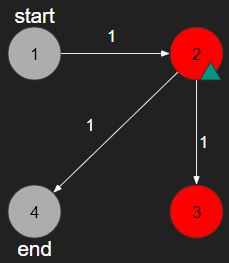
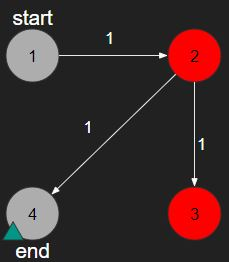
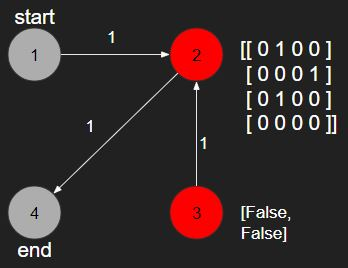
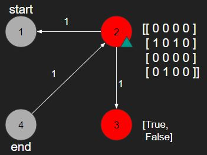

# [PGS] 미로탈출

문제링크 : [https://programmers.co.kr/learn/courses/30/lessons/81304#](https://programmers.co.kr/learn/courses/30/lessons/81304#)

<br/>

# 🔍 문제분석

- start지점에서 출발해서 연결된 길들을 거쳐서 end지점까지 가야한다.
- 가는 길에 trap 노드에 도착하면 해당 노드와 연결된 모든 길의 방향이 반대로 뒤집힌다.

ex)











경로는 다음과 같다.

```
1->2->3->2->4
```

그리고 출력값은 다음과 같다.

```
4
```

<br/>
<br/>

# 💡 아이디어

1. (n,n)의 2차원 리스트에 roads의 상태를 저장, traps 정렬, trap 상태에 대한 정보 초기화
2. BFS를 위한 nodequeue 초기화와 방문한 노드는 상태와 함께 딕셔너리 키로 시간과 함께 저장
3. nodequeue가 비워질때까지 BFS 시행
4. 현재 위치에서 이동할 때 현재 노드와 이동할 노드의 함정 활성화 상태에 따라서 이동 road 변경
5. end 노드에 도착 했을 경우 그 시간을 endvalue에 저장
6. 반복문을 계속 시행하다가 endvalue보다 시간이 길어지면 해당 경로는 건너뜀

- 상태 예시

    - 2, 3 두 노드 모두 비활성화 상태

    

    - 2 노드 활성화 상태

    